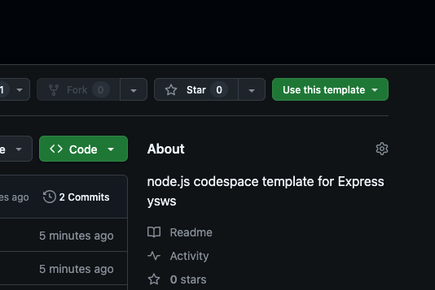
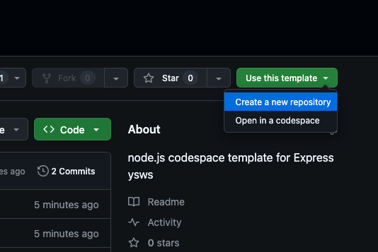
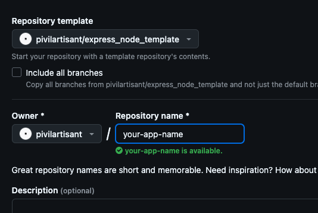
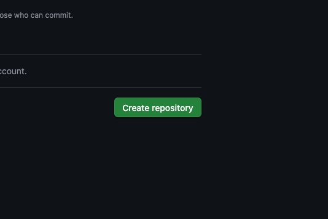
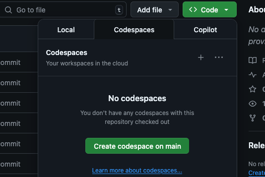

# express_node_template

This is a basic Node.js & Express template.

To use it, follow these steps:

**1.** Go to the top-left corner and click **"Use this template"** to open a dropdown.  

**2.** In the dropdown, click **"Create a new repository"**.  

**3.** Set your desired repository name.  

**4.** Click **"Create repository"**.  

**5.** In the newly created repository, click the green **"Code"** button, then select **"Create codespace on main"**.  

